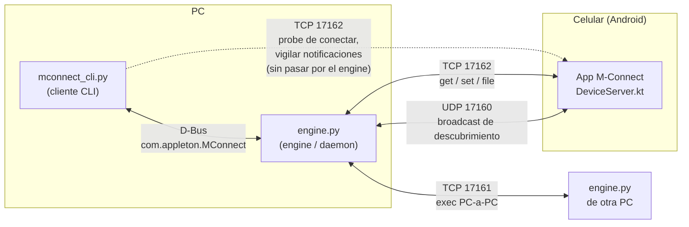

> [!NOTE]
> To read the English version of this document, click [here](README_ENG.md).

---

<picture>
  <source media="(prefers-color-scheme: dark)" srcset="Assets/banner.png">
  <source media="(prefers-color-scheme: light)" srcset="Assets/banner_dark.png">
  
</picture>


**M-Connect** ("Musen" + "Connect" - *musen* 無線 es japonés para "inalámbrico") es una CLi diseñada para ser simple, bonita y liviana. Este proyecto no busca ser una alternativa a programas como KDE Connect o una continuación del proyecto Y-Connect, sino una base sólida que se puede usar para proyectos de este estilo en el futuro: un daemon de PC, un cliente de línea de comandos y una app de Android que permiten que una computadora y un móvil se descubran en la red local y se hablen entre sí. 

> [!CAUTION]
> Este proyecto se encuentra en desarrollo; su funcionamiento puede cambiar con el tiempo. Este programa no cuenta con autenticación ni emparejamiento en ningún canal; lee [Limitaciones y seguridad conocidas](#limitaciones-y-seguridad-conocidas) antes de usar esto en algo que no sea una red local de confianza.

---

# Tabla de contenidos

- [Arquitectura](#arquitectura)
- [Estructura del repositorio](#estructura-del-repositorio)
- [Requisitos](#requisitos)
- [Primeros pasos](#primeros-pasos)
- [Referencia de comandos de la CLI](#referencia-de-comandos-de-la-cli)
- [Referencia del protocolo](#referencia-del-protocolo)
- [Limitaciones y seguridad conocidas](#limitaciones-y-seguridad-conocidas)
- [Licencia](#licencia)


---

# Arquitectura

M-Connect está dividido en tres piezas que solo se comunican entre sí mediante protocolos bien definidos: sin código compartido, sin acoplamiento fuerte. Es intencional: es lo que permite que el engine cambie de lenguaje más adelante, y que una GUI exista junto a la CLI sin que ninguna dependa de la otra.



**`engine.py`** es el daemon que hace el trabajo de red real: anuncia esta PC en la red local, escucha otros dispositivos, corre un servidor de exec para control PC-a-PC, y reenvía pedidos de `device-get`/`device-set`/archivos a un celular conectado. Expone todo esto por **D-Bus** (nombre de bus `com.appleton.MConnect`, ruta de objeto `/com/appleton/MConnect/Engine`) para que cualquier cliente, esta CLI o una futura GUI pueda manejarlo sin reimplementar nada de la red.

**`mconnect_cli.py`** es un cliente delgado. Arranca `engine.py` solo si no está corriendo, mantiene una conexión D-Bus persistente durante toda la sesión y traduce los comandos escritos en llamadas D-Bus. Dos comandos (el probe de `conectar` y el stream en vivo de `vigilar-dispositivo`) hablan directamente con el celular por TCP en vez de pasar por el engine, un atajo deliberado mientras esa parte del diseño del engine sigue siendo básica.

**La app de Android** corre `DeviceServer.kt`, un pequeño servidor TCP que responde a pedidos `get`/`set`/`file`/`watch`, más un broadcast de identidad en segundo plano para que el engine la pueda descubrir. Leer info de multimedia y notificaciones requiere que el usuario le otorgue a la app el permiso especial de **Acceso a Notificaciones** de Android (el mismo requisito que tiene KDE Connect real).

## Por qué D-Bus, por qué asyncio, por qué sin GLib

Todo el lado PC es Python `asyncio`, incluida la capa D-Bus (vía [`dbus-next`](https://github.com/altdesktop/dbus-next), no `pydbus`/`dbus-python`). Fue una decisión deliberada: el mainloop de GLib también funcionaría, pero es una dependencia extra sin beneficio para un proyecto que todavía no tiene UI. Si/cuando se construya una GUI, el propio soporte D-Bus de GLib (`Gio.DBusProxy`) puede hablar con el mismo nombre de bus e interfaz sin cambiar nada del lado del engine.

## Por qué el engine sigue en Python por ahora

El plan es, eventualmente, reescribir `engine.py` en C o [Vala](https://vala.dev/) para un daemon más liviano y siempre activo, pero recién *después* de que la interfaz D-Bus y los protocolos estén estables. Los bindings de GDBus de Vala pueden implementar exactamente el mismo nombre de bus, ruta de objeto y firmas de métodos de forma nativa, así que los clientes no van a necesitar cambiar cuando eso pase. Reescribir ahora, mientras el protocolo sigue cambiando semana a semana, significaría rehacer ese trabajo más de una vez.

---

# Estructura del repositorio
 
```
.
├── engine.py                  # Daemon de PC: descubrimiento, servidor exec, reenvío de device-get/set/file, servicio D-Bus
├── mconnect_cli.py             # Cliente CLI: REPL, cliente D-Bus, probe/watch directo al celular
└── mconnect-android/            # Proyecto de Android Studio
    ├── app/src/main/java/com/appleton/mconnect/
    │   ├── MainActivity.kt           # UI: lista de descubrimiento, conectar, botón de acceso a notificaciones
    │   ├── DeviceServer.kt           # Servidor TCP: battery/volume/multimedia/device/storage/find/notifications/file
    │   └── NotificationListener.kt   # NotificationListenerService mínimo (desbloquea lectura de media y notificaciones)
    └── app/src/main/AndroidManifest.xml
```
 
---

# Requisitos

**Lado PC** (Python 3.10+):

```bash
pip install dbus-next prompt_toolkit --break-system-packages
```

Una sesión  de bus de D-Bus corriendo (estándar en cualquier escritorio Linux; `dbus-daemon --session` si necesitas uno a mano, por ejemplo en un contenedor mínimo).

**Lado Android:**

- Android 7.0 (API 24) o superior para correr la app en lo absoluto
- **Android 10 (API 29) o superior** para `enviar-archivo` (usa la API de almacenamiento con alcance `MediaStore`: no hay fallback para versiones más viejas)
- La misma red WiFi que la PC, con el **aislamiento de clientes/AP desactivado** en el router (el aislamiento bloquea por completo el broadcast UDP de descubrimiento: esto trabó varias pruebas tempranas)
- Acceso a Notificaciones otorgado a la app (`Ajustes > Apps > M-Connect > Acceso a notificaciones`, o el botón dentro de la app) para cualquier cosa bajo `multimedia` o `notificaciones`

---

# Primeros pasos

2. Compila e instala la app de Android desde `mconnect-android/` en tu móvil (Android Studio; necesita acceso real a internet para Gradle/Maven, así que no se puede compilar en un entorno aislado).

4. Abrí la app una vez para que empiece a anunciarse y a escuchar en el puerto de control del dispositivo.

6. En la PC, simplemente ejecuta la CLI; la app arranca `engine.py` automáticamente:

   ```bash
   python3 mconnect_cli.py
   ```

8. Dentro de la shell:

   ```
   ❯ descubrir
   ❯ conectar <ip-del-celular-de-la-lista-de-arriba>
   ❯ obtener-dispositivo bateria porcentaje-actual
   ```

Si `engine.py` ya está corriendo (lo arrancaste a mano o una sesión anterior de la CLI lo dejó corriendo), la CLI lo detecta y lo reutiliza en vez de arrancar uno nuevo. Un log con la salida propia del engine queda en `~/.mconnect_engine.log` para cuando algo falle en silencio.

#### Correr `engine.py` solo

Útil para que dos PCs se hablen entre sí (`exec`), o para debuggear el engine aparte de la CLI:

```bash
python3 engine.py
```

---

# Referencia de comandos de la CLI

| Comando                                    | Descripción                                                                                                                  |
| ------------------------------------------ | ---------------------------------------------------------------------------------------------------------------------------- |
| `ayuda [comando]`                          | Ayuda estilo man page. Sin argumentos, lista todos los comandos; `ayuda <comando>` muestra la página completa de ese comando. |
| `descubrir`                                | Lista los dispositivos que se están anunciando en la red local.                                                              |
| `conectar <ip>`                            | Verifica que el dispositivo sea realmente alcanzable (prueba el puerto TCP 17162) antes de marcarlo como dispositivo activo. |
| `obtener-dispositivo <categoria> <campo>`  | Lee un valor del dispositivo conectado. Ver categorías abajo.                                                                    |
| `ajustar-dispositivo <categoria> <valor>`  | Cambia algo en el dispositivo conectado. Ver categorías abajo.                                                                   |
| `vigilar-dispositivo notificaciones`       | Muestra notificaciones nuevas en vivo a medida que llegan, hasta Ctrl+C. Se conecta directamente al dispositivo.                      |
| `enviar-archivo <ruta-local> [subcarpeta]` | Envía un archivo de la PC a `Download/M-Connect[/subcarpeta]` en el móvil                                                |
| `limpiar`                                  | Limpia la pantalla.                                                                                                          |
| `salir`                                    | Cierra la shell (Ctrl+C también funciona).                                                                                   |

Presiona **Tab** en cualquier momento para autocompletar comandos, categorías, campos, valores y las IPs de dispositivos conocidos. **Arriba/Abajo** navegan por el historial de comandos (guardado en `~/.mconnect_history`). La primera palabra de la línea se colorea solo cuando es un comando reconocido.

### Categorías de `obtener-dispositivo`

| Categoría        | Campo                  | Devuelve                                                                                                     |
| ---------------- | ---------------------- | ------------------------------------------------------------------------------------------------------------ |
| `bateria`        | `porcentaje-actual`    | Nivel de carga de la batería (%)                                                                             |
| `volumen`        | `porcentaje-actual`    | Nivel de volumen multimedia (%)                                                                              |
| `multimedia`     | `reproduciendo-actual` | Título, artista, estado y app de origen de lo que se está reproduciendo *(requiere Acceso a Notificaciones)* |
| `dispositivo`    | `informacion`          | Modelo, fabricante, versión de Android                                                                       |
| `almacenamiento` | `espacio-libre`        | Almacenamiento interno libre, en MB                                                                          |
| `notificaciones` | `actual`               | Lista de notificaciones que se muestran actualmente *(requiere Acceso a Notificaciones)*                     |

### Categorías de `ajustar-dispositivo`

| Categoría    | Valor                                                 | Efecto                                                                    |
| ------------ | ----------------------------------------------------- | ------------------------------------------------------------------------- |
| `volumen`    | `0`–`100`                                             | Pone el volumen multimedia en ese porcentaje                              |
| `multimedia` | `reproducir` \| `pausar` \| `siguiente` \| `anterior` | Controla la sesión multimedia activa *(requiere Acceso a Notificaciones)* |
| `encontrar`  | `sonar`                                               | Suena al volumen máximo de alarma y vibra 10 segundos                     |

---

# Referencia del protocolo
 
> **Nota:** el protocolo que viaja por la red sigue en **inglés**, aunque los comandos de la CLI estén en español, la app de Android ya está compilada esperando estas palabras exactas (`"battery"`, `"volume"`, etc.). La CLI traduce internamente lo que escribes al protocolo antes de mandarlo.
 
Todos los mensajes van como **JSON delimitado por saltos de línea**, un objeto JSON por línea, sin prefijos de longitud salvo el payload en base64 de `enviar-archivo`, que va inline en su propia línea.
 
### Descubrimiento: broadcast UDP, puerto `17160`
 
Cada participante (engines de PC y la app del celular por igual) lo transmite cada 2 segundos, y escucha lo mismo de los demás:
 
```json
{"type": "identity", "deviceId": "<uuid>", "deviceName": "<hostname o modelo>", "port": <puerto-de-control>}
```
 
Un dispositivo se considera desaparecido 6 segundos después de su último anuncio.
 
### Exec PC-a-PC: TCP, puerto `17161`
 
Para dos máquinas corriendo ambas `engine.py`. De un solo viaje: conectar, mandar una línea, leer una línea, listo.
 
```json
→ {"type": "exec", "command": "uname -a"}
← {"type": "exec_result", "exit_code": 0, "stdout": "...", "stderr": ""}
```
 
Solo corre **entre engines** (PC↔PC); el celular no tiene servidor de exec, por diseño; correr comandos de shell arbitrarios no mapea bien a Android.
 
### Control del celular desde la PC: TCP, puerto `17162` (`DeviceServer.kt`)
 
`get`/`set` de un solo viaje:
 
```json
→ {"type": "get", "category": "battery", "field": "current-percentage"}
← {"type": "get_result", "ok": true, "value": 76}
 
→ {"type": "set", "category": "volume", "value": "50"}
← {"type": "set_result", "ok": true}
```
 
Ante cualquier error, `ok` es `false` y `error` tiene un mensaje legible (permiso de notificaciones faltante, valor inválido, conexión rechazada, etc.).
 
Stream en vivo (la conexión queda abierta; un evento por línea hasta que el cliente se desconecta):
 
```json
→ {"type": "watch", "category": "notifications"}
← {"type": "notification_event", "source": "com.whatsapp", "title": "Alex", "text": "hey, estas libre mas tarde?"}
← {"type": "notification_event", "source": "...", "title": "...", "text": "..."}
...
```
 
Transferencia de archivos (contenido codificado en base64 inline: simple, pero no eficiente para archivos muy grandes; ver [Limitaciones conocidas](#limitaciones-y-seguridad-conocidas)):
 
```json
→ {"type": "file", "name": "foto.jpg", "subdir": "vacaciones", "data_base64": "..."}
← {"type": "file_result", "ok": true}
```
 
Los archivos terminan en `Download/M-Connect/<subcarpeta>/` (o `Download/M-Connect/` sin subcarpeta) vía la API `MediaStore` de Android.
 
### Interfaz D-Bus del engine
 
Nombre de bus `com.appleton.MConnect`, ruta de objeto `/com/appleton/MConnect/Engine`:
 
| Método | Firma | Notas |
|---|---|---|
| `Discover` | `() → a(ss)` | Array de `(deviceName, address)` para los dispositivos conocidos actualmente |
| `Exec` | `(address: s, command: s) → (iss)` | `(exit_code, stdout, stderr)`, solo PC-a-PC |
| `DeviceGet` | `(address: s, category: s, field: s, extra: s) → s` | Devuelve un **string JSON** (evita por completo el tipado de structs de D-Bus — las formas de los resultados varían demasiado por categoría como para modelarlas como un struct fijo) |
| `DeviceSet` | `(address: s, category: s, value: s) → s` | Devuelve un string JSON, mismo motivo |
| `DeviceFile` | `(address: s, local_path: s, subdir: s) → s` | Lee el archivo local, lo codifica en base64, lo reenvía; devuelve un string JSON |
 
---


## Limitaciones y seguridad conocidas
 
Son carencias registradas, no descuidos: léelas antes de usar esto en algo que no sea una LAN de confianza:
 
- **No hay autenticación ni emparejamiento en ningún canal.** Cualquier dispositivo en la red local puede ahora mismo llamar a `exec` en una PC corriendo `engine.py`, o mandar pedidos `device-get`/`device-set` a un celular corriendo la app. No existe todavía un equivalente al emparejamiento con certificados TLS de KDE Connect u otras apps. **No expongas esto más allá de una red local de confianza.**
- **La transferencia de archivos es base64 sobre una línea JSON**, lo cual es simple pero infla el tamaño en ~33% y mantiene el archivo completo en memoria en ambos lados. Está bien para prototipar; un protocolo binario con prefijo de longitud sería el arreglo real para archivos grandes.
- **`engine.py` no está autenticado ni aislado por la naturaleza de la función de exec**, tratá cualquier máquina que lo corra como alcanzable y controlable por cualquier otra cosa en el mismo segmento de LAN.
---
 
## Licencia
 
GNU General Public License v3.0 o posterior. Ver el aviso de licencia que imprime la CLI al arrancar o el archivo `LICENSE` en este repositorio.
 
