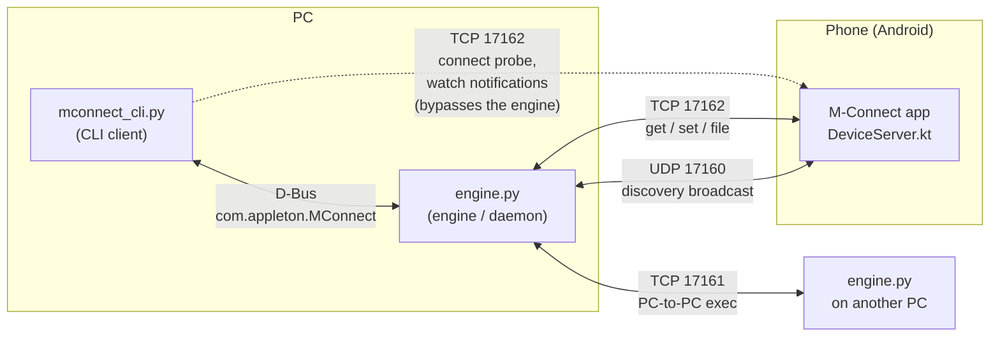

> [!NOTE]
> Para leer la versión en español de este documento, haz clic [aquí](README.md).
> *(To read the Spanish version of this document, click [here](README.md).)*

---

<picture>
  <source media="(prefers-color-scheme: dark)" srcset="Assets/banner.png">
  <source media="(prefers-color-scheme: light)" srcset="Assets/banner_dark.png">
  
</picture>


**M-Connect** ("Musen" + "Connect" - *musen* 無線 is Japanese for "wireless") is a CLI designed to be simple, beautiful, and lightweight. This project does not aim to be an alternative to programs like KDE Connect, nor a continuation of the Y-Connect project, but rather a solid foundation that can be used for projects of this kind in the future: a PC daemon, a command-line client, and an Android app that let a computer and a phone discover each other on the local network and talk to one another.

> [!CAUTION]
> This project is under development; its behavior may change over time. This program has no authentication or pairing on any channel; read [Known limitations and security](#known-limitations-and-security) before using it on anything other than a trusted local network.

---

# Table of contents

- [Architecture](#architecture)
- [Repository structure](#repository-structure)
- [Requirements](#requirements)
- [Getting started](#getting-started)
- [CLI command reference](#cli-command-reference)
- [Protocol reference](#protocol-reference)
- [Known limitations and security](#known-limitations-and-security)
- [License](#license)


---

# Architecture

M-Connect is split into three pieces that only talk to each other through well-defined protocols: no shared code, no tight coupling. This is intentional: it's what allows the engine to change languages later on, and a GUI to exist alongside the CLI without either depending on the other.



**`engine.py`** is the daemon that does the actual networking work: it announces this PC on the local network, listens for other devices, runs an exec server for PC-to-PC control, and forwards `device-get`/`device-set`/file requests to a connected phone. It exposes all of this over **D-Bus** (bus name `com.appleton.MConnect`, object path `/com/appleton/MConnect/Engine`) so that any client, this CLI or a future GUI, can drive it without reimplementing any of the networking.

**`mconnect_cli.py`** is a thin client. It starts `engine.py` only if it isn't already running, keeps a persistent D-Bus connection open for the whole session, and translates typed commands into D-Bus calls. Two commands (the `conectar` probe and the live `vigilar-dispositivo` stream) talk directly to the phone over TCP instead of going through the engine, a deliberate shortcut while that part of the engine's design is still basic.

**The Android app** runs `DeviceServer.kt`, a small TCP server that answers `get`/`set`/`file`/`watch` requests, plus a background identity broadcast so the engine can discover it. Reading media and notification info requires the user to grant the app Android's special **Notification Access** permission (the same requirement the real KDE Connect has).

## Why D-Bus, why asyncio, why no GLib

The entire PC side is Python `asyncio`, including the D-Bus layer (via [`dbus-next`](https://github.com/altdesktop/dbus-next), not `pydbus`/`dbus-python`). This was a deliberate decision: the GLib mainloop would also work, but it's an extra dependency with no benefit for a project that doesn't have a UI yet. If/when a GUI is built, GLib's own D-Bus support (`Gio.DBusProxy`) can talk to the same bus name and interface without changing anything on the engine side.

## Why the engine is still in Python for now

The plan is to eventually rewrite `engine.py` in C or [Vala](https://vala.dev/) for a lighter, always-on daemon, but only *after* the D-Bus interface and the protocols are stable. Vala's GDBus bindings can natively implement exactly the same bus name, object path, and method signatures, so clients won't need to change when that happens. Rewriting now, while the protocol is still changing week to week, would mean redoing that work more than once.

---

# Repository structure
 
```
.
├── engine.py                  # PC daemon: discovery, exec server, device-get/set/file forwarding, D-Bus service
├── mconnect_cli.py             # CLI client: REPL, D-Bus client, direct probe/watch to the phone
└── mconnect-android/            # Android Studio project
    ├── app/src/main/java/com/appleton/mconnect/
    │   ├── MainActivity.kt           # UI: discovery list, connect, notification access button
    │   ├── DeviceServer.kt           # TCP server: battery/volume/multimedia/device/storage/find/notifications/file
    │   └── NotificationListener.kt   # Minimal NotificationListenerService (unlocks media and notification reading)
    └── app/src/main/AndroidManifest.xml
```
 
---

# Requirements

**PC side** (Python 3.10+):

```bash
pip install dbus-next prompt_toolkit --break-system-packages
```

A running D-Bus session bus (standard on any Linux desktop; `dbus-daemon --session` if you need one on hand, for example in a minimal container).

**Android side:**

- Android 7.0 (API 24) or higher to run the app at all
- **Android 10 (API 29) or higher** for `enviar-archivo` (it uses the scoped `MediaStore` storage API: there is no fallback for older versions)
- The same WiFi network as the PC, with **client/AP isolation disabled** on the router (isolation completely blocks the UDP discovery broadcast: this stalled several early tests)
- Notification Access granted to the app (`Settings > Apps > M-Connect > Notification access`, or the button inside the app) for anything under `multimedia` or `notificaciones`

---

# Getting started

1. Build and install the Android app from `mconnect-android/` on your phone (Android Studio; it needs real internet access for Gradle/Maven, so it can't be built in an isolated environment).

2. Open the app once so it starts announcing itself and listening on the device control port.

3. On the PC, simply run the CLI; it starts `engine.py` automatically:

   ```bash
   python3 mconnect_cli.py
   ```

4. Inside the shell:

   ```
   ❯ descubrir
   ❯ conectar <phone-ip-from-the-list-above>
   ❯ obtener-dispositivo bateria porcentaje-actual
   ```

If `engine.py` is already running (you started it by hand, or a previous CLI session left it running), the CLI detects it and reuses it instead of starting a new one. A log with the engine's own output is kept at `~/.mconnect_engine.log` for when something fails silently.

#### Running `engine.py` on its own

Useful for getting two PCs to talk to each other (`exec`), or for debugging the engine separately from the CLI:

```bash
python3 engine.py
```

---

# CLI command reference

> [!NOTE]
> Command names, categories, and fields are in Spanish, exactly as implemented in the CLI.

| Command                                    | Description                                                                                                                  |
| ------------------------------------------ | ---------------------------------------------------------------------------------------------------------------------------- |
| `ayuda [comando]`                          | Man-page-style help. With no arguments, lists all commands; `ayuda <comando>` shows that command's full page.                |
| `descubrir`                                | Lists the devices currently announcing themselves on the local network.                                                      |
| `conectar <ip>`                            | Verifies that the device is actually reachable (probes TCP port 17162) before marking it as the active device.               |
| `obtener-dispositivo <categoria> <campo>`  | Reads a value from the connected device. See categories below.                                                               |
| `ajustar-dispositivo <categoria> <valor>`  | Changes something on the connected device. See categories below.                                                             |
| `vigilar-dispositivo notificaciones`       | Shows new notifications live as they arrive, until Ctrl+C. Connects directly to the device.                                  |
| `enviar-archivo <ruta-local> [subcarpeta]` | Sends a file from the PC to `Download/M-Connect[/subcarpeta]` on the phone.                                                  |
| `limpiar`                                  | Clears the screen.                                                                                                           |
| `salir`                                    | Exits the shell (Ctrl+C also works).                                                                                         |

Press **Tab** at any time to autocomplete commands, categories, fields, values, and the IPs of known devices. **Up/Down** navigate the command history (stored in `~/.mconnect_history`). The first word of the line is only colored when it is a recognized command.

### `obtener-dispositivo` categories

| Category         | Field                  | Returns                                                                                                      |
| ---------------- | ---------------------- | ------------------------------------------------------------------------------------------------------------ |
| `bateria`        | `porcentaje-actual`    | Battery charge level (%)                                                                                     |
| `volumen`        | `porcentaje-actual`    | Media volume level (%)                                                                                       |
| `multimedia`     | `reproduciendo-actual` | Title, artist, state, and source app of what is currently playing *(requires Notification Access)*           |
| `dispositivo`    | `informacion`          | Model, manufacturer, Android version                                                                         |
| `almacenamiento` | `espacio-libre`        | Free internal storage, in MB                                                                                 |
| `notificaciones` | `actual`               | List of currently displayed notifications *(requires Notification Access)*                                   |

### `ajustar-dispositivo` categories

| Category     | Value                                                 | Effect                                                                    |
| ------------ | ----------------------------------------------------- | ------------------------------------------------------------------------- |
| `volumen`    | `0`–`100`                                             | Sets the media volume to that percentage                                  |
| `multimedia` | `reproducir` \| `pausar` \| `siguiente` \| `anterior` | Controls the active media session *(requires Notification Access)*        |
| `encontrar`  | `sonar`                                               | Rings at maximum alarm volume and vibrates for 10 seconds                 |

---

# Protocol reference
 
> **Note:** the protocol that travels over the network is still in **English**. Even though the CLI commands are in Spanish, the Android app is already compiled expecting these exact words (`"battery"`, `"volume"`, etc.). The CLI internally translates what you type into the protocol before sending it.
 
All messages are sent as **newline-delimited JSON**, one JSON object per line, with no length prefixes, except for the base64 payload of `enviar-archivo`, which goes inline on its own line.
 
### Discovery: UDP broadcast, port `17160`
 
Every participant (PC engines and the phone app alike) broadcasts this every 2 seconds, and listens for the same from the others:
 
```json
{"type": "identity", "deviceId": "<uuid>", "deviceName": "<hostname or model>", "port": <control-port>}
```
 
A device is considered gone 6 seconds after its last announcement.
 
### PC-to-PC exec: TCP, port `17161`
 
For two machines both running `engine.py`. Single round trip: connect, send one line, read one line, done.
 
```json
→ {"type": "exec", "command": "uname -a"}
← {"type": "exec_result", "exit_code": 0, "stdout": "...", "stderr": ""}
```
 
It only runs **between engines** (PC↔PC); the phone has no exec server, by design: running arbitrary shell commands doesn't map well to Android.
 
### Controlling the phone from the PC: TCP, port `17162` (`DeviceServer.kt`)
 
Single round-trip `get`/`set`:
 
```json
→ {"type": "get", "category": "battery", "field": "current-percentage"}
← {"type": "get_result", "ok": true, "value": 76}
 
→ {"type": "set", "category": "volume", "value": "50"}
← {"type": "set_result", "ok": true}
```
 
On any error, `ok` is `false` and `error` holds a human-readable message (missing notification permission, invalid value, connection refused, etc.).
 
Live stream (the connection stays open; one event per line until the client disconnects):
 
```json
→ {"type": "watch", "category": "notifications"}
← {"type": "notification_event", "source": "com.whatsapp", "title": "Alex", "text": "hey, are you free later?"}
← {"type": "notification_event", "source": "...", "title": "...", "text": "..."}
...
```
 
File transfer (content base64-encoded inline: simple, but not efficient for very large files; see [Known limitations](#known-limitations-and-security)):
 
```json
→ {"type": "file", "name": "photo.jpg", "subdir": "vacation", "data_base64": "..."}
← {"type": "file_result", "ok": true}
```
 
Files end up in `Download/M-Connect/<subfolder>/` (or `Download/M-Connect/` with no subfolder) via Android's `MediaStore` API.
 
### Engine D-Bus interface
 
Bus name `com.appleton.MConnect`, object path `/com/appleton/MConnect/Engine`:
 
| Method | Signature | Notes |
|---|---|---|
| `Discover` | `() → a(ss)` | Array of `(deviceName, address)` for the currently known devices |
| `Exec` | `(address: s, command: s) → (iss)` | `(exit_code, stdout, stderr)`, PC-to-PC only |
| `DeviceGet` | `(address: s, category: s, field: s, extra: s) → s` | Returns a **JSON string** (avoids D-Bus struct typing entirely — result shapes vary too much by category to model them as a fixed struct) |
| `DeviceSet` | `(address: s, category: s, value: s) → s` | Returns a JSON string, same reason |
| `DeviceFile` | `(address: s, local_path: s, subdir: s) → s` | Reads the local file, base64-encodes it, forwards it; returns a JSON string |
 
---


## Known limitations and security
 
These are recorded gaps, not oversights: read them before using this on anything other than a trusted LAN:
 
- **There is no authentication or pairing on any channel.** Any device on the local network can right now call `exec` on a PC running `engine.py`, or send `device-get`/`device-set` requests to a phone running the app. There is not yet an equivalent to KDE Connect's (or other apps') TLS certificate pairing. **Do not expose this beyond a trusted local network.**
- **File transfer is base64 over a JSON line**, which is simple but inflates the size by ~33% and keeps the entire file in memory on both sides. It's fine for prototyping; a length-prefixed binary protocol would be the real fix for large files.
- **`engine.py` is neither authenticated nor isolated, by the very nature of the exec feature**: treat any machine running it as reachable and controllable by anything else on the same LAN segment.
---
 
## License
 
GNU General Public License v3.0 or later. See the license notice the CLI prints at startup, or the `LICENSE` file in this repository.
